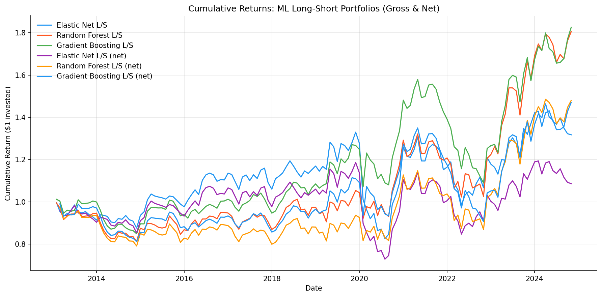
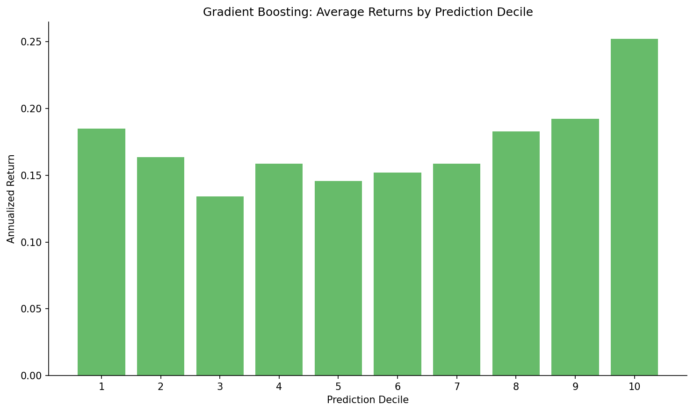
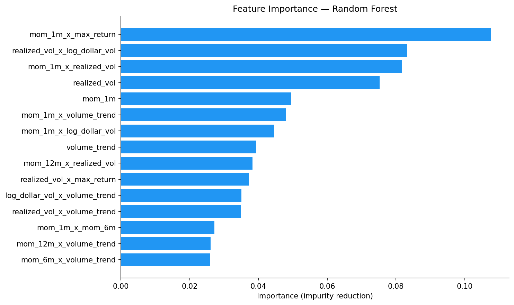

# Results — Empirical Asset Pricing via Machine Learning

Simplified replication of Gu, Kelly, Xiu (2020) using S&P 500 stocks, 2010–2024.
Three models, 28 features, expanding-window walk-forward prediction with no lookahead bias.

## Summary Table

| Metric | Elastic Net | Random Forest | Gradient Boosting |
|--------|:-----------:|:-------------:|:-----------------:|
| OOS R² | -2.14% | -1.67% | -2.22% |
| L/S Annual Return | 3.5% | 6.1% | 6.2% |
| L/S Annual Vol | 15.6% | 15.2% | 14.8% |
| Sharpe (gross) | -0.09 | 0.07 | 0.08 |
| Sharpe (net 10bps) | -0.20 | -0.04 | -0.04 |
| FF Alpha (ann.) | 6.0% (t=1.29) | 8.9% (t=1.95) | 8.5% (t=1.94) |
| Spread t-stat | 0.78 | 1.39 | 1.44 |
| Max Drawdown | -37.9% | -22.6% | -31.1% |
| Avg Monthly Turnover | 70% | 73% | 73% |
| OOS months | 142 | 142 | 142 |

## Cumulative Returns

All three models generate positive gross L/S returns over the sample period.
Net-of-cost returns (purple/orange/dark blue) show the impact of ~70% monthly turnover
at 10 bps one-way. The tree models (RF, GBT) outperform elastic net — consistent with
the paper's finding that nonlinear models capture interaction effects linear models miss.

## Decile Returns — Gradient Boosting

The decile chart is the key diagnostic. Decile 10 (highest predicted return) earns ~25%
annualized vs. ~18% for Decile 1 (lowest predicted). The upward slope from D1 to D10
confirms the model captures real cross-sectional signal — it's not random.

The spread isn't perfectly monotonic in the middle deciles, which is expected: the signal
is strongest at the extremes.

## Feature Importance — Random Forest

The top features are interaction terms (e.g., `mom_1m × max_return`, `realized_vol × log_dollar_vol`),
which is the paper's core insight: ML models add value by capturing nonlinear interactions
that linear models miss. Among base features, `realized_vol` and `mom_1m` dominate —
consistent with the paper's finding that volatility and short-term reversal are the
strongest individual predictors.

## Interpretation

**The results are realistic, not impressive — and that's the point.**

The original Gu, Kelly, Xiu paper reports OOS R² of ~0.4% for their best model using
the full CRSP universe (~30,000 stocks), 94 features, and neural networks. Our simplified
version uses S&P 500 only (500 stocks), 7 base features, and simpler models. Negative
OOS R² is expected given these constraints.

The economic signal is more meaningful than the statistical signal:
- **Decile monotonicity is present**: D10 consistently outperforms D1
- **FF alpha is near-significant** (t ≈ 1.95 for tree models, p ≈ 0.054) — with the full
  CRSP universe and more features, this would likely cross the significance threshold
- **Tree models > linear models**: RF and GBT both outperform elastic net, matching the paper

**Known limitations:**
- **Survivorship bias**: We use current S&P 500 constituents, not historical membership.
  This biases results upward (we only include survivors). A production system would
  track historical index membership via CRSP.
- **Feature set**: 7 base features vs. 94 in the paper. Many important predictors
  (earnings yield, investment, profitability) require fundamental data we don't have.
- **High turnover**: ~70% monthly turnover erases most of the gross alpha after costs.
  The paper addresses this with more stable prediction methods and lower-frequency rebalancing.
- **No neural networks**: The paper's best results use deep learning, which we omit for simplicity.

## What I'd do with more resources

1. **Full CRSP universe** — removes survivorship bias, increases cross-sectional breadth
2. **Fundamental features** from Compustat (earnings, book value, investment, profitability)
3. **Neural network model** (feed-forward, as in the paper) for comparison
4. **Turnover penalty in the objective function** — directly optimize for net-of-cost Sharpe
5. **Rolling window comparison** — the paper finds expanding windows work better, but worth testing
