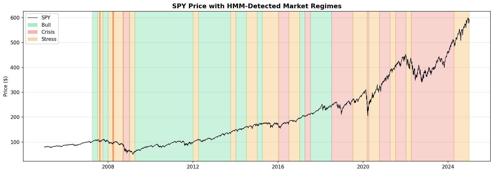
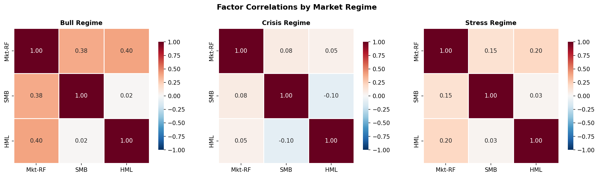
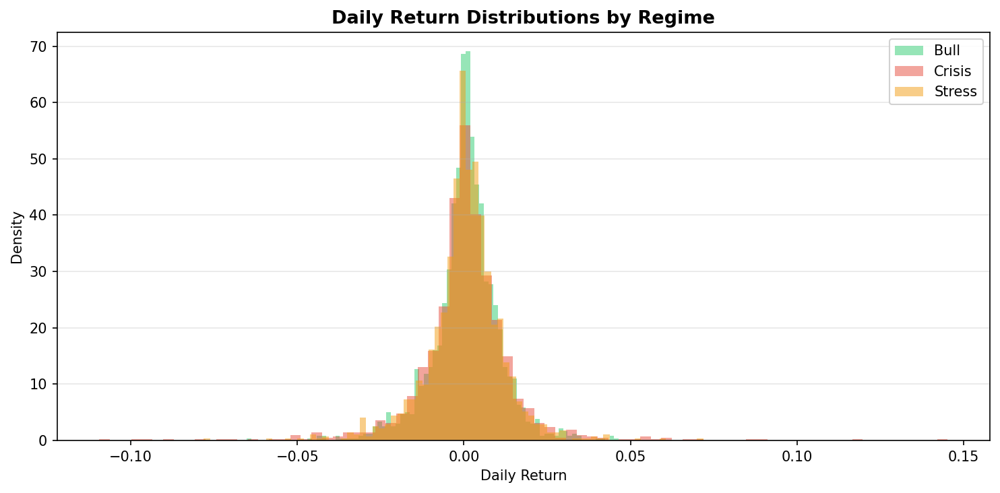
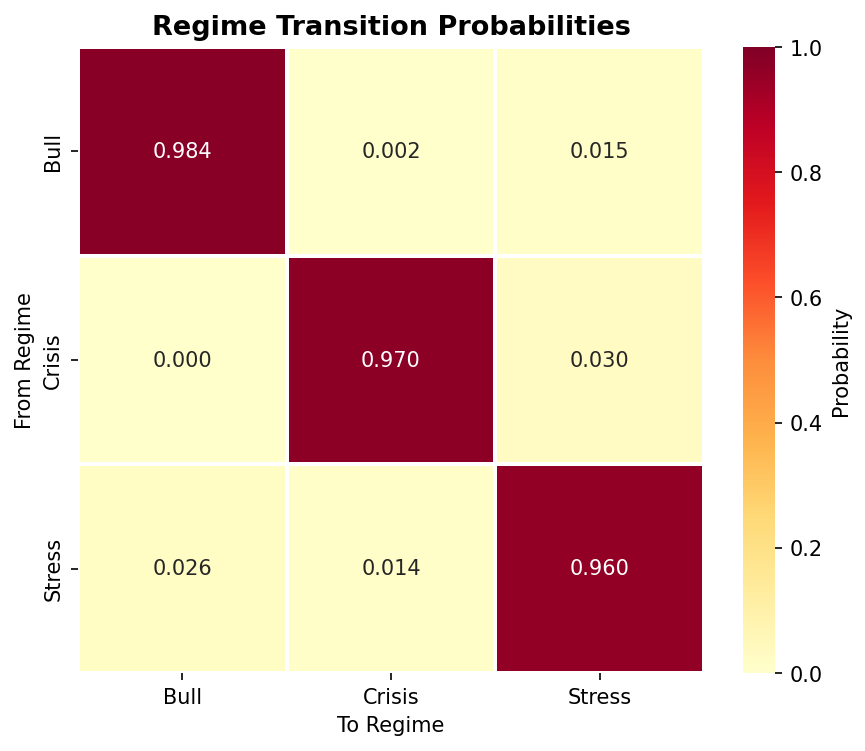

# Results — Regime Detection & Factor Risk Dashboard

**Data:** SPY daily returns + VIX, 2005-01-03 to 2024-12-31 (5,031 trading days)
**Model:** 3-state Gaussian HMM, walk-forward with quarterly refit, 504-day minimum history
**Factors:** Fama-French daily (MKT-RF, SMB, HML) from Ken French's data library

## Regime Summary

| Regime | Days | % of Total | Ann. Return | Ann. Vol | Sharpe | 95% VaR | Max Drawdown |
|--------|------|-----------|-------------|----------|--------|---------|-------------|
| Bull   | 1,702 | 38.1% | 16.8% | 16.2% | 1.03 | -1.66% | -18.6% |
| Stress | 1,456 | 32.6% | 9.4% | 18.3% | 0.52 | -1.94% | -34.0% |
| Crisis | 1,307 | 29.3% | 8.0% | 25.2% | 0.32 | -2.19% | -42.0% |

## Risk Underestimation

| Metric | Unconditional | Bull | Stress | Crisis |
|--------|--------------|------|--------|--------|
| 95% VaR | -1.87% | -1.66% | -1.94% | -2.19% |
| 95% CVaR | -3.06% | -2.49% | -2.87% | -3.93% |

**Key finding:** Crisis-regime CVaR (-3.93%) is 1.3x the unconditional CVaR (-3.06%). A risk manager using only unconditional metrics understates worst-case daily losses by ~30% during crises.

## Transition Matrix

|         | → Bull | → Stress | → Crisis |
|---------|--------|----------|----------|
| Bull    | 0.984  | 0.015    | 0.002    |
| Stress  | 0.026  | 0.960    | 0.014    |
| Crisis  | 0.000  | 0.030    | 0.970    |

**Expected durations:** Bull ~62 days, Crisis ~34 days, Stress ~25 days.

Regimes are highly persistent (diagonal >0.96). Markets don't flip randomly — once in a crisis, the probability of staying in crisis the next day is 97.0%.

## Factor Behavior by Regime

| Factor | Bull Sharpe | Stress Sharpe | Crisis Sharpe |
|--------|------------|---------------|---------------|
| MKT-RF | 1.01 | 0.45 | 0.22 |
| SMB | 0.32 | -0.02 | -0.36 |
| HML | -0.26 | -0.31 | 0.09 |

**Key findings:**
- **MKT premium collapses in crises:** Sharpe drops from 1.01 (Bull) to 0.22 (Crisis)
- **SMB reverses in crises:** Small caps underperform in stress/crisis (flight to quality)
- **HML is regime-dependent:** Value factor behaves differently across regimes

## Charts

### Regime Timeline

SPY price with HMM-detected regime shading. The model correctly identifies major stress periods including the 2008 GFC and 2020 COVID crash.

### Factor Correlations by Regime

Correlation structure shifts across regimes. In crises, factor correlations tend to change — diversification assumptions that hold in calm markets may break down.

### Return Distributions

Crisis returns are wider and more left-skewed. The fat tails that matter for risk management are concentrated in the crisis regime.

### Transition Matrix

High diagonal values show regime persistence. The near-zero Bull→Crisis probability means markets typically pass through Stress before reaching Crisis.

## Interpretation

This analysis demonstrates that:
1. **Unconditional risk metrics understate crisis risk** — blending calm and crisis periods masks the true tail
2. **Factor premiums are regime-dependent** — a factor that works in bull markets may not work in crises
3. **Correlation structure shifts by regime** — diversification fails when you need it most
4. **Regimes are persistent** — once detected, the current regime is likely to continue

These insights directly inform portfolio management: a PM should condition risk limits on the current regime, not use a single unconditional number.
