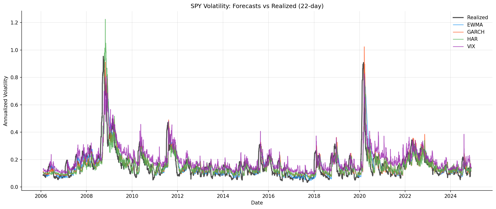
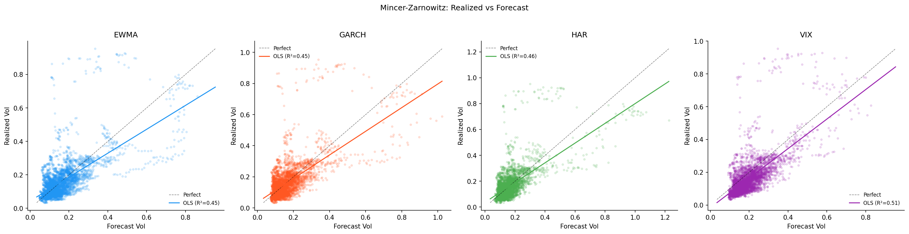
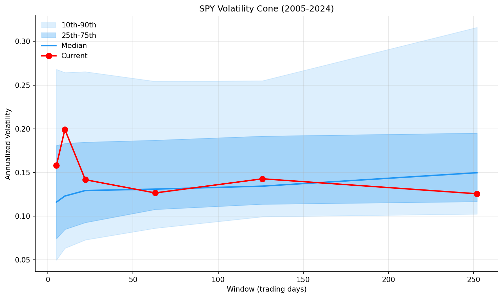
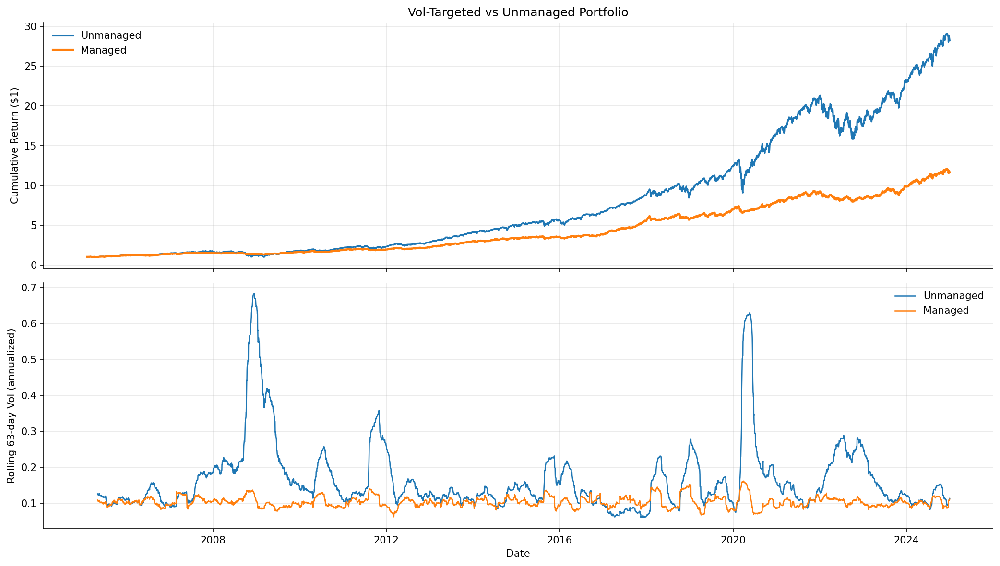

# Results — Volatility Forecasting & Vol-Targeting

Four vol forecast models compared on SPY daily returns, 2005-2024 (4,736 common trading days after alignment). Vol-targeting backtest on 50 liquid S&P 500 stocks.

## Forecast Model Comparison

| Metric | EWMA | GARCH | HAR-RV | VIX |
|--------|:----:|:-----:|:------:|:---:|
| QLIKE | 0.0957 | 0.0891 | **0.0882** | 0.0935 |
| MSE | 0.0079 | 0.0075 | **0.0074** | 0.0076 |
| MAE | 0.0529 | **0.0523** | **0.0523** | 0.0620 |
| MZ R² | 45.2% | 45.4% | 46.2% | **50.6%** |
| MZ alpha | 0.044 | 0.036 | 0.037 | **-0.016** |
| MZ beta | 0.714 | 0.761 | 0.763 | **0.901** |

**Rankings (by QLIKE, lower = better):**
1. HAR-RV (0.0882)
2. GARCH (0.0891)
3. VIX (0.0935)
4. EWMA (0.0957)

## Forecast vs Realized Vol

All four models track realized vol well, with clear spikes during the 2008 GFC, 2011 debt ceiling crisis, 2015 China deval, 2018 Volmageddon, March 2020 COVID crash, and 2022 rate hikes. The models differ most during rapid regime changes — VIX leads (it's forward-looking), while EWMA lags (it's purely backward-looking).

## Mincer-Zarnowitz Scatter Plots

The scatter plots show realized vol vs. forecast vol for each model. VIX has the tightest cluster around the 45-degree line (R² = 50.6%), confirming it's the most informative single forecast. The positive alpha on EWMA/GARCH/HAR means they systematically under-predict vol — a bias risk managers should be aware of.

VIX's negative alpha (-0.016) means it slightly over-predicts vol on average — this is the volatility risk premium. Investors pay a premium for downside protection, pushing VIX above expected realized vol.

## Volatility Cone

The vol cone shows the historical distribution of SPY realized vol at different horizons. Current vol (red dots) sits near the middle of the distribution — neither historically elevated nor unusually depressed. The cone widens at shorter horizons because short-term vol is noisier.

## Vol-Targeting Backtest

| Metric | Unmanaged | Vol-Targeted |
|--------|:---------:|:------------:|
| Annual Return | 18.64% | 12.89% |
| Annual Vol | 19.10% | **10.47%** |
| Sharpe | 0.714 | **0.753** |
| Sortino | 0.889 | **1.010** |
| Max Drawdown | -43.43% | **-16.38%** |
| Skewness | -0.118 | -0.588 |
| Kurtosis | 12.343 | **2.393** |

**Key takeaways:**
- **Max drawdown cut by 27 percentage points** (-43.4% → -16.4%). This is the headline result. During the 2008 GFC, vol spiked and the strategy automatically scaled down, avoiding the worst of the crash.
- **Kurtosis dropped from 12.3 to 2.4** — the return distribution went from extremely fat-tailed to nearly normal. This matters for risk models that assume normality (like parametric VaR).
- **Sharpe improved modestly (+0.04)** because you avoid the worst risk-adjusted periods. The improvement is larger on Sortino (+0.12) because the strategy specifically reduces downside.
- **Return dropped** from 18.6% to 12.9% because the strategy runs at lower average leverage (~0.5x). This is the trade-off: you give up some return for dramatically better risk properties.

## Interpretation

**The results confirm the three key facts about vol forecasting:**

1. **Vol is predictable.** All four models achieve MZ R² of 45-51%, far exceeding what any return prediction model can achieve. This is why vol forecasting is a cornerstone of quant risk.

2. **Model choice matters less than you'd think.** The spread between the best (HAR-RV, QLIKE = 0.088) and worst (EWMA, QLIKE = 0.096) model is small. The hard part is getting the framework right (proper evaluation, no lookahead) — not choosing between GARCH and HAR.

3. **Vol-targeting works.** The strategy delivers its theoretical promise: better risk-adjusted returns, dramatically lower tail risk, and a more normal return distribution. The improvement is robust because it exploits a durable feature of financial markets (vol clustering and the leverage effect), not a fragile statistical pattern.

**What a hiring manager should take away:** This project demonstrates end-to-end quant risk infrastructure — from data acquisition to model estimation to forecast evaluation to portfolio construction — using industry-standard methodology and proper out-of-sample discipline.
